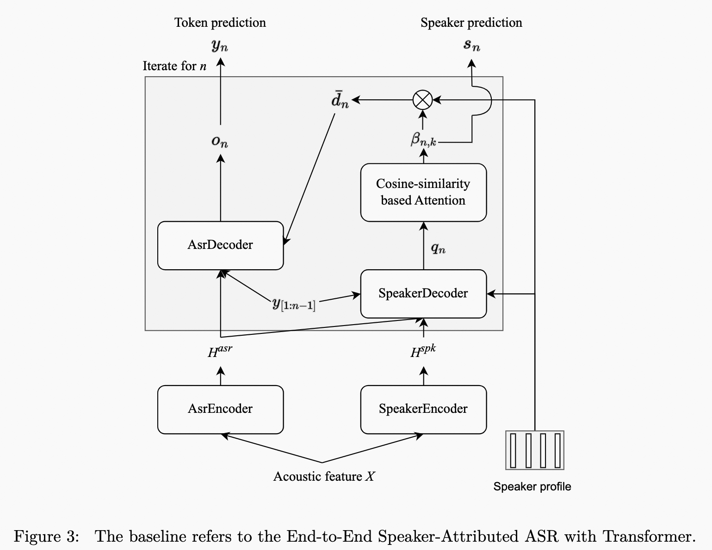

# Baseline
## Overview
We will release an E2E SA-ASR~\cite{kanda21b_interspeech} baseline conducted on [FunASR](https://github.com/alibaba-damo-academy/FunASR) at the time according to the timeline. The model architecture is shown in Figure 3. The SpeakerEncoder is initialized with a pre-trained speaker verification model from ModelScope. This speaker verification model is also be used to extract the speaker embedding in the speaker profile.

## Quick start
#TODO: fill with the README.md of the baseline

## Baseline results
The results of the baseline system are shown in Table 3. The speaker profile adopts the oracle speaker embedding during training. However, due to the lack of oracle speaker label during evaluation, the speaker profile provided by an additional spectral clustering is used. Meanwhile, the results of using the oracle speaker profile on Eval and Test Set are also provided to show the impact of speaker profile accuracy. 

