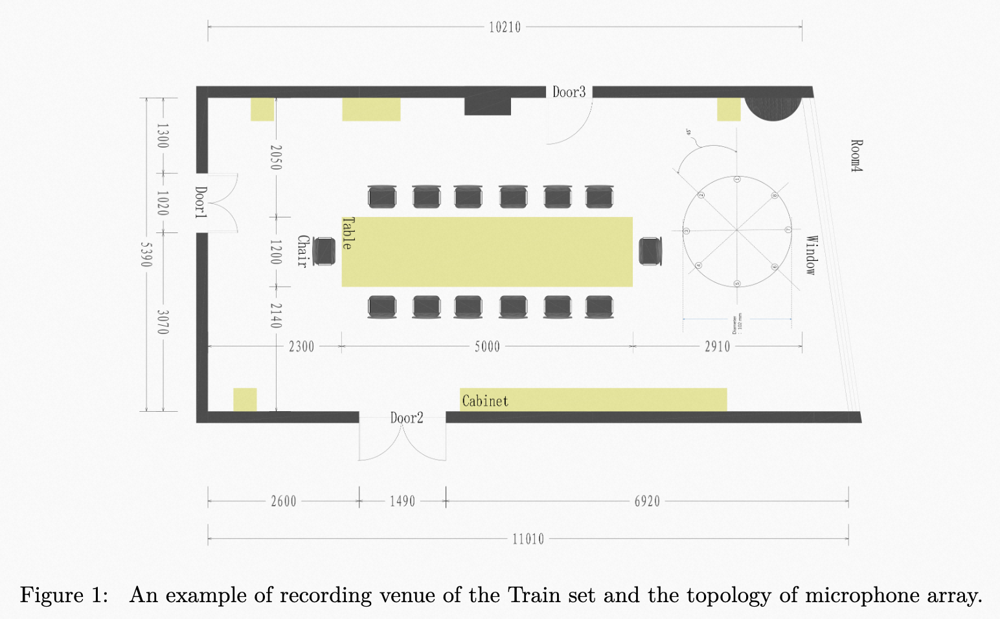
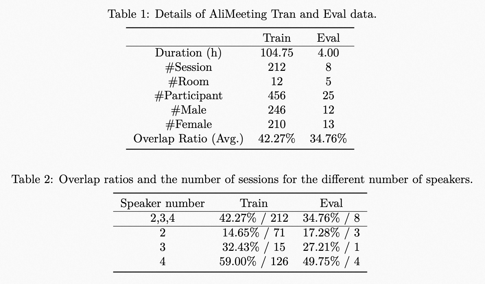

# 数据集
## 数据集概述
在限定数据集条件下，训练数据集仅限于三个公开的语料库，即AliMeeting、AISHELL-4和CN-Celeb。为了评估参赛者提交的模型的性能，我们将发布一个新的测试集（Test-2023）用于打分和排名。下面我们将详细描述AliMeeting数据集和Test-2023测试集。

## Alimeeting数据集介绍
AliMeeting总共包含118.75小时的语音数据，包括104.75小时的训练集（Train）、4小时的验证集（Eval）和10小时的测试集（Test）。Train集和Eval集分别包含212场和8场会议，其中每场会议由多个说话人进行15到30分钟的讨论。Train和Eval集中参与会议的总人数分别为456人和25人，并且参会的男女比例人数均衡。

该数据集收集于13个不同的会议室，按照大小规格分为小型、中型和大型三种，房间面积从8到55平方米不等。不同房间具有不同的布局和声学特性，每个房间的详细参数也将发送给参与者。会议场地的墙体材料类型包括水泥、玻璃等。会议场地的家具包括沙发、电视、黑板、风扇、空调、植物等。在录制过程中，麦克风阵列放置于桌上，多个说话人围坐在桌边进行自然对话。麦克风阵列离说话人距离约0.3到5.0米之间。所有说话人的母语均是汉语，并且说的都是普通话，没有浓重的口音。在会议录制期间可能会产生各种室内的噪音，包括键盘声、开门/关门声、风扇声、气泡声等。所有说话人在会议的录制期间均保持相同位置，不发生走动。训练集和验证集的说话人没有重复。图1展示了一个会议室的布局以及麦克风的拓扑结构。

每场会议的说话人数量从2到4人不等。同时为了覆盖各种内容的会议场景，我们选择了多种会议主题，包括医疗、教育、商业、组织管理、工业生产等不同内容的例会。Train集，Eval集和Test集的平均语音重叠率分别为42.27\%和34.76\%。AliMeeting Train集，Eval集和Test集的详细信息见表1。表2显示了Train集,Eval集和Test集中不同发言者人数会议的语音重叠率和会议数量。

Test-2023测试集由20场会议组成，这些会议是在与AliMeeting数据集相同的声学环境下录制的。Test-2023测试集中的每个会议环节由2到4个参与者组成并且与AliMeeting测试集的配置相似。

我们还使用耳机麦克风记录了每个说话人的近场音频信号，并确保只转录对应说话人自己的语音。需要注意的是，麦克风阵列记录的远场音频和耳机麦克风记录的近场音频在时间上是同步的。每场会议的所有抄本均以TextGrid格式存储，内容包括会议的时长、说话人信息（说话人数量、说话人ID、性别等）、每个说话人的片段总数、每个片段的时间戳和转录内容。

## 获取数据
以上提到的三个训练集均可以在[OpenSLR](https://openslr.org/resources.php)下载. 参赛者可以使用下方链接直接下载. 针对AliMeeting数据集，比赛提供的baseline中包含了完整的数据处理流程。
- [AliMeeting](https://openslr.org/119/)
- [AISHELL-4](https://openslr.org/111/)
- [CN-Celeb](https://openslr.org/82/)